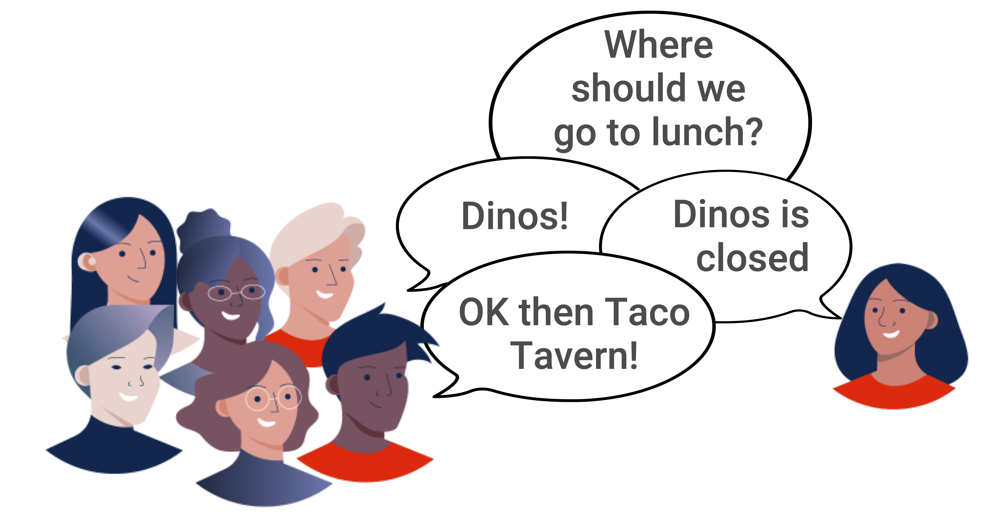
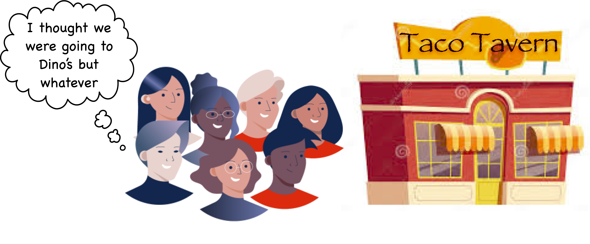
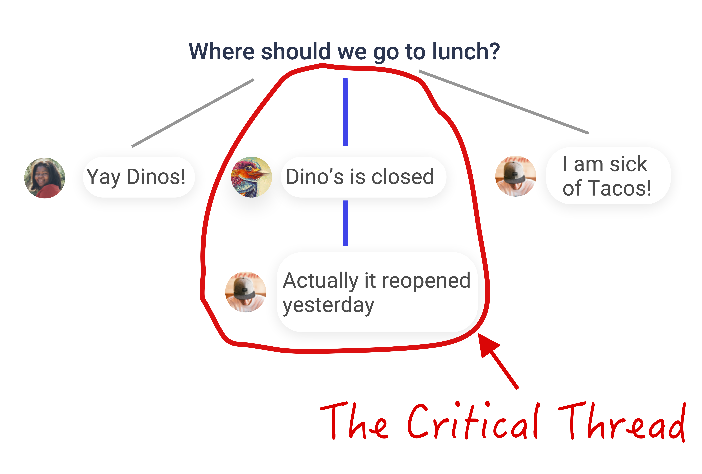

A [deliberative poll](https://en.wikipedia.org/wiki/Deliberative_opinion_poll) measures the **informed opinion** of a group of people who have participated in a discussion about the topic of the poll. This essay introduces a method for integrating deliberative polling into online discussions in social platforms, in order to discover the informed opinion of a group. 

<!--more-->

## Summary

- Discussion is necessary for a group to produce logically consistent, informed judgments.
- But because [online discussions are asynchronous](#the-asynchronous-discussion-problem), important comments are sometimes overlooked, and not reflected in the group judgment.
- The deliberative poll addresses this by:
    1. **[Directing attention to comments](#directing-attention)** that warrant follow-through
    2. [Displaying the **deliberative consensus**](#the-deliberative-consensus) instead of the initial poll results
- The process focuses the conversation on a **[critical thread](#the-critical-thread)** of comments and their replies.
- The aggregate judgment is calculated to reflect a [**consistent and informed judgment**](#judgment-aggregation) of the group.
- This process can be invisibly [integrated into social platforms](#integration-into-social-platforms) where people vote on and discuss content.
- This method should not only produce better judgments: it is also [more fair and democratic](#conclusion). 

## The Asynchronous Discussion Problem

The Deliberative Poll is inspired by a very important principle: **discussion helps groups make better judgments**. Discussion is how the knowledge and ideas spread among a diverse group of individuals is aggregated into collective intelligence.  

But online discussions are often less effective than in-person conversations. If we are all in the same room, I can look each person in the eye and see who is listening and engaged, and expect immediate responses to what I say (even if the response is overt silence). But in an online group discussion, I don't even know who is "listening", let alone when or if they will respond. As a result , and **important comments sometimes get ignored**.

For example, suppose a group of coworkers votes on where to go to lunch. Six people vote for Dino's, but Alice votes for Taco Tavern and says "Dino's is closed today."

In person, that comment would settle the matter: everybody who voted for Dino's would change their vote. 

<!--  -->

Online, however, this kind of comment is often overlooked, buried in a comment thread that nobody reads.

Even those who do read Alice's comment will not necessarily react by changing their votes. So the poll results will often be stale, representing initial reactions and not the informed, reasoned consensus of the group.

A Deliberative Poll addresses this issue in two simple ways: 

1. It **directs attention to comments** that have been overlooked and that **warrant follow-through**.
2. It displays a poll result that represents the **deliberative consensus**, not just the initial vote.

## Directing Attention

In our example, the system will place a prompt in the feed or the notifications of one or two people who voted for Dino's, asking, in a manner of speaking, "Hey did you see Alice's comment? What do you think?" 

Like a good facilitator, the system recognizes that Alice's comment represents a **reason** not to vote with the majority for Dino's. It notices that **nobody in the majority read her comment**, and it reasons that a **coherent judgment** probably requires that somebody do so, and so it notifies them to make sure they do.

Suppose that two people respond and change their vote to Taco Tavern. Where does the group go to lunch? 

## The Deliberative Consensus 

The Deliberative Poll will display the **deliberative consensus** next to the overall poll results. In our example, the deliberative consensus will be 3:0 in favor of Taco Tavern (Alice plus the two others who changed their vote) -- even though the overall poll results are still 4:3 for Dino's.

This is because there was a **unanimous consensus for Taco Tavern among the people who saw Alice's comment** -- that is, those who participated in the critical discussion thread and were informed on all the points that were raised.

Suppose the group has adopted a norm of making decisions based on the deliberative consensus. Then they will all happily head over to Taco Tavern at lunch-time. The four who didn't change their vote may not even know *why* they are going to Taco Tavern notwithstanding the overall vote -- but if they have confidence in the deliberative poll process they will know that there was a reason for the change of plan and trust the group decision. 

Suppose on the other hand that Bob didn't trust the result, and really wanted to go to Dino's. He could have clicked on the thread and read Alice's comment: **his vote would then have been counted in the deliberative consensus**. If he agreed with Alice, he might have changed his vote. If he disagreed with Alice, he could have responded with his reason, and the system would have continued the conversation and asked Alice and others who agree with her to respond.

## The Critical Thread

The deliberative poll process focuses the conversation on the **critical thread**. The critical thread starts with the comment by somebody in the *minority* that receives the most upvotes. This comment can be seen as the main reason that people question the majority vote, and is therefore **the comment that most warrants follow-through**. The process then drives the discussion forward by asking some people in the majority to respond to that critical comment. 

If the comment doesn't change minds, people may respond with a reason. For example Bob might respond to Alice and say "Actually Dino's re-opened yesterday." If this is the most-upvoted (or only) counter-argument, it becomes the next item in the critical thread. 

The system will then call this counter-argument to the attention of Alice and others who upvoted her argument, and the process will continue.

As the conversation proceeds, the deliberative consensus may flip back and forth, with the result being determined by a smaller and smaller group of more and more informed participants.

## Resolution of Discussions

But the discussion won't go on for ever; it will end when new arguments are no longer changing the deliberative consensus. This will happen for one of two reasons:

1. People stop arguing. For example, if Dino's really did re-open yesterday, Alice may just accept the decision to go to Dino's, and the conversation will end there.

1. The latest argument does not change the deliberative consensus. For example, if Alice responds "But I don't *like* Dino's", but nobody is convinced by this argument, there is no need for them to respond. As long as members of the pro-Dino's majority have *seen* Alice's argument, but have not changed their minds, the informed opinion is still in favor of Dino's. Unless somebody comes up with a more convincing argument, the argument is over.

## Logically Consistent Group Judgments

The academic field of Judgment Aggregation came into existence with the discovery of the [Deliberative Dilemma](https://en.wikipedia.org/wiki/Discursive_dilemma#:~:text=Discursive%20dilemma%20or%20doctrinal%20paradox,result%20in%20self%2Dcontradictory%20judgments.): a paradoxical situation where the aggregate beliefs of a group are logically inconsistent, even though the beliefs of each individual member are logically consistent.

A similar paradox exists in our discussion about where to go to lunch. Consider the following three propositions, with the ratio of voters who agree (in parentheses).

- (𝐴) We should go to Dino's for lunch (4:3)
- (𝐵) Dino's is closed... (3:0)
- (𝐶) ...and that is a good reason not to go there for lunch (3:0)
 
For each proposition, a majority of those who voted agree. Yet these three propositions are logically inconsistent. No rational person could agree with all three. In fact, each of the seven team members holds a logically consistent set of judgments: either they agree with 𝐴 but have no opinion on 𝐵 and 𝐶, or they disagree with 𝐴 and agree with 𝐵 and 𝐶.

So the inconsistency in aggregate judgment exists only because not everyone is voting on the full set of propositions. And since one of these propositions contains information (the fact that Dino's is closed), it means not everyone has all relevant information. If the four voters who agree with 𝐴 were asked to vote on 𝐵, they would probably either disagree with 𝐵 or change their vote on 𝐴.

It is clear that this sort of logical inconsistency will exist in many group discussions if we only look at the majority opinion for each proposition, because each person is exposed to different information and arguments.

## The Hypothetical Fully-Informed Opinion

So to aggregate the judgment of a group, instead of tabulating majority opinions, we can get more logically consistent group judgment by asking the question: *what would the average group member believe if they had voted on all propositions*?

It should be clear that the answer to this question is a **probability**. And a proper probability estimate requires more than a simple ratio of fully-formed users that agree, because the number of votes might be quite small. In our example, only two people saw Alice's comment and changed their vote. This is evidence that the majority would also change their vote if they also saw Alice's comment, but how strong is this evidence?

Properly answering this question requires us to have prior beliefs about voters' opinions and to update those beliefs after obtaining votes using the rules of Bayesian belief revision. In [Distributed Bayesian Reasoning](/distributed-bayesian-reasoning-introduction), we expand on this principle and develop a formula for evaluating arbitrarily large and complex discussions with many branches, allowing us to estimate the probability that participants would agree with a proposition if everyone shared the same information, even if no individual actually participates in any more than a very small part of the discussion.

## Integration into Social Platforms

The basic process can be applied even outside of formal polls. Many social sites involve voting on posts (via likes or upvotes/downvotes), as well as voting on comments in the threads underneath posts. From this information, a  deliberative consensus can be calculated for any post! The system can implement the deliberative poll process by directing attention to critical comments simply by promoting them in the user's feed or notifications. 

Replacing counts of likes or votes with deliberative consensus could help a social platform promote and amplify higher-quality content.

## Conclusion

A deliberative poll doesn't just produce more informed and logically consistent group judgments: **it is more essentially democratic** than a simple vote based on knee-jerk reactions and first impressions.

Almost everybody has experienced the frustration of dysfunctional online group discussions and decision-making. This is why good facilitators are so essential to well-functioning groups: they help prevent the sense of frustration, arbitrariness and irrationality that comes from logically inconsistent decisions and lack of follow-through on important points that have been raised.

The deliberative poll process is designed not just to facilitate fair and informed judgments, but also *efficient* conversations, **sparing the limited attention of users by keeping conversation focused** on the critical thread and prompting people to respond just enough to determine the deliberative consensus.

The process is like **a cross between a ticket system and a good human facilitator**. It has a simple, even-handed idea of what follow-through has to happen to ensure fair and logical results, and it tracks status and gently reminds people to respond until key points have been adequately addressed.

Conversations in deliberative polls can be designed to be essentially indistinguishable from the types of threaded conversations already found on many social sites. But these simple mechanisms result in deeper, more satisfying conversations, and more fair and informed group judgments. Combined with a [mechanisms for promoting **honesty**](/truthtelling-games), this method can be used to amplify the **honest and informed opinion** in a social platform, in order to help [Give Truth the Advantage](/give-truth-the-advantage).

