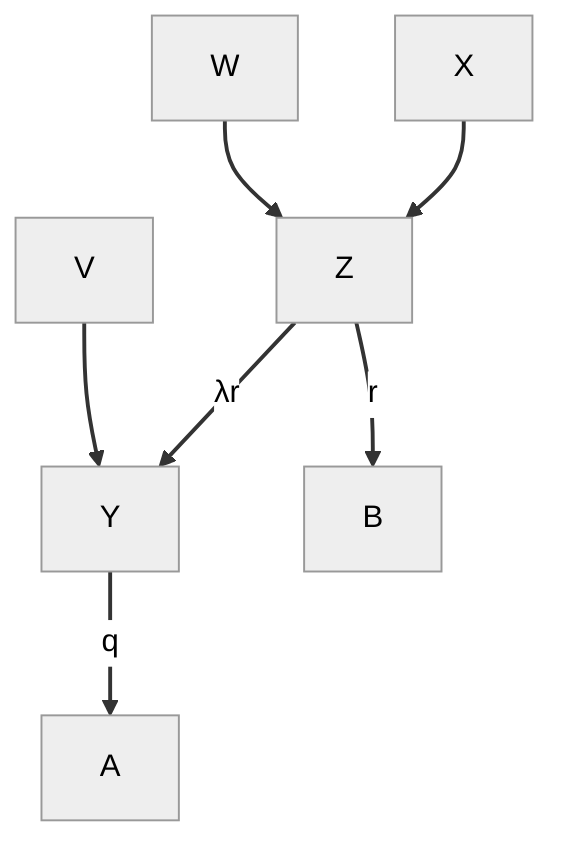

# More Formal Derivation of Support Formula

In my notes on the [support formula](2024-03-01-support-formula.md) I used some fairly informal reasoning to derive the formula.

Here are my thoughts on a somewhat more formal derivation.

## The Causal Model

First, we start with laying out our causal model as a graph. Consider a post A with a note B, which in turn has note C. Let's define the following variables:

- **V**: User has considered A
- **W**: User has considered B
- **X**: User has considered C

- **Y**: The belief underlying A
- **Z**: The belief underlying B

- **A**: User votes on A
- **B**: User votes on B

Y and Z are latent variables. We can't measure them but we need to assume they exist because there is not a direct causal between the variables we *can* measure. For example votes on B do not not cause votes on A. Rather, *considering* B (a event we designated W) causes a change in some underlying belief Z, which causes upvotes on B, and also changes to underlying belief Y, which in term causes upvotes to A.

This underlying belief in Z may have different effects on B and Y. For example, the note might be very witty, causing users to believe that Z *this is witty*, which causes them to be upvote B. But Z might not have any effect at all on Y, and thus no effect on upvotes on A.

Now our goal is to estimate the probability that a user upvotes A given they consider C, assuming we don't (yet) have have data for users that voted on A after considering C. What we have instead is data for users who voted on A before and after considering B , and who voted on B before and after considering C. In other words, we want to estimate the indirect effect of C on A based on the effect of C on B and the effect of B on A.

To work this out, let's walk step by step through what we think happens as users successively consider posts A, B, and then C. 

- First, some users consider post A (V=1), which causes, for these users:
  - The probability of believing Y (the belief underyling A) to move from y0 to y1, which causes
    - A (probability of upvoting A) to move from a0 to a1

- Next, some users consider post B (W=1), which causes, for these users:
  - The probability of believing Z (the belief underlying B) to move from z1 to z2, which causes
    - B (probability of upvoting B) to move from b0 to b1
    - Y to move from y1 to y2, which cuases
      - A to move from a1 to a2

- Finally, some users who considered post B also consider post C (X=1), which causes, for these users:
  - Z to move from z2 to z3
    - B to move from b1 to b2
    - Y to move fro y2 to y3
    - A to move from a2 to a3

Some of these variables we can measure. Specifically, a1 and a2 (probability of upvoting A before/after considering B), and b1 and b2 (probability of upvoting B before/after considering C). 

Now, the relationships between all these variables is linear. Specifically, any increase in one variable causes a proportional change to all downstream variables. I discuss this linear relationship in my [previous note](2024-03-01-support-formula.md) and my post on [Bayesian Argumentation](https://jonathanwarden.com/bayesian-argumentation/).

So when Y moves from y0 to y1, increasing by $y1-y0$, A will increase by the same amount times some constant $q$. So $(a1-a0) = q*(y1-y0)$. Likewise, when Z increases by $z2 - z1$, B will increase by $(b1-b0)=r*(z2-z1)$, and Y will increase by $(y2-y1) =λr*(z2-z1)$.

So we have:

$$
\begin{aligned}
    b1 - b0 &= r(z1 - z0)  \newline
    y2 - y1 &= r\lambda(z1 - z0) \newline
    a2 - a1 &= q(y2 - y1)  \newline
            &= qr\lambda(z1 - z0) \newline
            &= q\lambda(b1 - b0) \newline
            &= q\lambda(b1 - b0) \newline
         q\lambda &= \frac{a2 - a1}{b1 - b0}
\end{aligned}
$$

Similarly we can show:

$$
    q\lambda = \frac{a3 - a1}{b2 - b0}
$$

So 

$$
  \frac{a2 - a1}{b1 - b0} = \frac{a3 - a1}{b2 - b0}
$$

And so finally:

$$
    a3 = a1 + (a2 - a1)\frac{b2 - b0}{b1 - b0}
$$

Now a2 is the quantity we are looking for: the probability that the users upvote A given they have considered C.

But this is not the support formula we derived in the [previous note](2024-03-01-support-formula.md)! It's similar: it's the same if we assume $b0=0$. Unfortunately, although we can measure a1, a2, b1, and b2, we can't measure b0! 

For that matter, what is b0? It is the probability of a user upvoting B before they considered B. But how can a user upvote something before they considered it? So it would be east to say that b0 is zero.

Unfortunately, I don't think it's so simple. B is a function of Z, and the probability of a user believing Z before seeing B is not zero.

I think that assuming B=0 is a *conservative* estimate, in that it assumes the smallest possible effect of C on A. For example, if C changes B from 99% to 1%, then no matter what the effect of B is on A, C will "erase" that effect. That is if B moves A from a1 to a2, C will move it almost back to a1, because. 

$$
\begin{aligned}
  a3  &= a1 + (a2 - a1)\times\frac{b2 - b0}{b1 - b0} \newline
      &= a1 + (a2 - a1)\times\frac{b2}{b1} \newline
      &= a1 + (a2 - a1)\times\frac{.01}{.99} \newline
      & \approx a1
\end{aligned}
$$

However, let's say that b0=.5. Now instead of erasing the effect of B, C *reverse* the effect.

$$
\begin{aligned}
  a3  &= a1 + (a2 - a1)\times\frac{b2 - b0}{b1 - b0} \newline
      &= a1 + (a2 - a1)\times\frac{.01 - .5}{.99 - .5} \newline
      &\approx a1 + (a2 - a1)\times-1 \newline
\end{aligned}
$$

Plugging in the number from the first example in the first scenario from the previous note, where a1=.46, a2=.9, b1=.99, and b2=.5. 

$$
\begin{aligned}
  a3  &= a1 + (a2 - a1)\times\frac{b2}{b1} \newline
      &= .46 + (.9 - .46)\times\frac{.01 - .50}{.99 - .50} \newline
      &= .46 + (.9 - .46)\times-1 \newline
      &= 22\%
\end{aligned}
$$

Intuitively, this makes sense to me. According to our causal graph, when W (seeing post B) causes a user to change their mind about A, it must also change their mind about Z, since W only effects A through Z. So users that changed their votes users most have believed, a priori, that Z was false, and then changed their belief given the content of B, and thus changed their vote on A.

But what about people who upvoted A *before* considering B. What did they believe about Z! We don't know. 

If we assume that z=0 -- nobody believed Z before considering B, whether or not they upvoted A, it follows that b=0 (because of the assumption that users only upvote things that they think are true, informative, and relevant). In this case, we arrive at the support formula from the [previous note](2024-03-01-support-formula.md).

But say we we assume most users who upvoted A (before considering B) also believed Z a priori. So the ones that changed their votes are the ones that didn't already know Z. This implies that Z is relevant to A: $P(A \vert Z=1)$ is close to 100%, and $P(A \vert Z=0)$ is close to 0%. 

Therefore if C convinces most people to reject Z, they would also reject A. That is, both groups of people would reject A after rejecting Z: both the people who upvoted A after considering B because they thought Z was true, and those who already thought Z was true.

