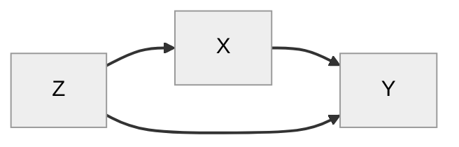

## Adjustment for Informed Vote Selection Bias

The informed upvote probability calculated from the informed tally suffers from a selection bias. People who choose to vote on the note may vote differently on the post from people who don't vote on the note. For example, people who passionately disagree with the post because of the reasons given in the note may be likely to upvote that note, whereas people who agree with the post may be less enthusiastic. So the informed probability would disproportionately represent people who disagreed in the first place.

What we want is for the people who vote on the note to be representative of the users who originally voted on the post. The original group of voters on the post may be biased, but that's a different problem (e.g. to be solved using Matrix factorization).

Another way to see the problem is using a causal graph. We have a typical case of a confounding variable.  Let's define:

- Z: The user's original, uniformed vote on the post (upvote or downvote)
- X: The user votes on the note (vote or no vote)
- Y: The user's final informed vote on the post (upvote or downvote)

This is a bit over-simplified, because as we discussed in the previous note on the [support formula derivation](2024-03-05-support-formula-derivation.md), voting doesn't cause voting, but rather some underlying opinion/mental state causes users to vote. But to get the intuition behind the problem let's treat people's votes as a proxy for their opinion.

So the user's opinion on the post (Z) influences whether or not they even vote on the note (X), and also influences their final informed vote (Y). But voting on the note also influences their final vote. 

As an analogy, whether or not the user is sick (Z) influences whether or not they end up in a hospital (X), and also influences whether they end up dead (Y). But being in the hospital also influences whether they end up dead.

We could remove this bias if everyone who voted on the post also voted on the note, but we can't make people vote on the note. Or if we could control which users voted on the note and randomly selected users to do so.

Another solution is to use the (backdoor) adjustment formula discussed in Judea Pearl's books. The above causal graph justifies using the below formula to "simulate an intervention", the intervention being making somebody vote on the note. This formula tells us that, even though not everybody who voted on the post also voted on the note, if they *did*, this is how they would have voted.

$$
	P(Y|do(x)) = ∑_z P(Y \vert x,z)P(z)
$$

Or more verbosely.

$$
\begin{aligned}
	&P(\text{upvote post}|do(\text{vote on note})) \\
	&= P(\text{upvote post}|\text{originally upvoted post, vote on note}) × P(\text{originally upvoted post})  \\ 
	&+ P(\text{upvote post}|\text{originally downvoted post, vote on note}) × P(\text{originally downvoted post}) \\  
end{aligned}
$$

So to implement this, we need two informed tallies: one for people who originally upvoted, and one for people who originally downvoted.

