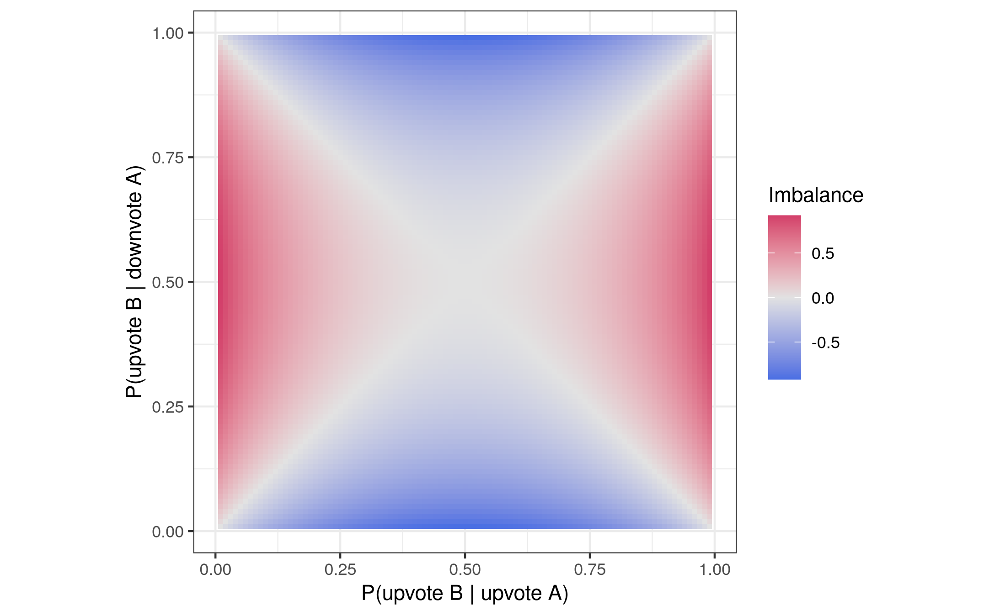
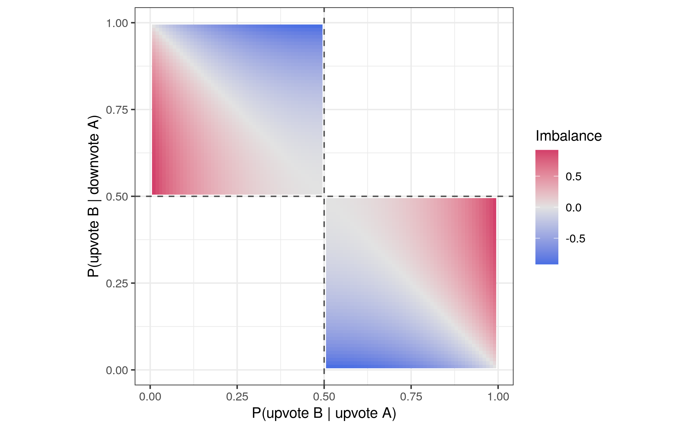
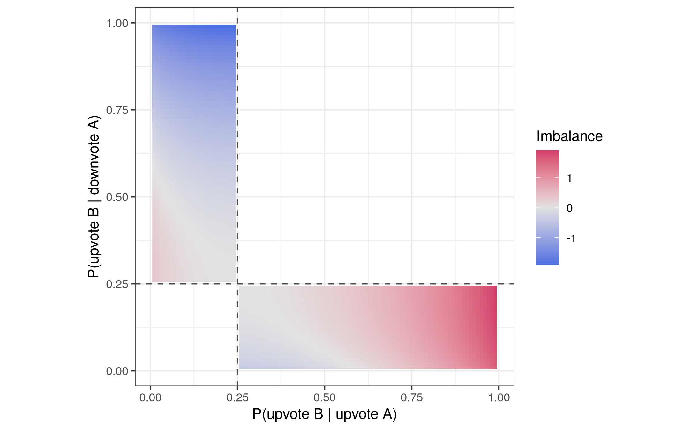

# Measuring Convincingness

A lot of the Global Brain algorithm revolves around the concept of convincingness.
We approached the concept of convincingness as *how convincing a comment is with regard to the post it replies to*, measuring it as how likely are users to change their vote on the target post given that they considered the comment.
There are some core assumptions behind this rationale that I'd like to examine more closely.

## Reexamining Some Assumptions

### 1) People will change their votes if they change their minds

Users usually tend to do the actions which have the least friction and take the least effort (scrolling through a feed, liking something with one click, clicking on the next recommended video on YouTube or even have autoplay enabled, etc.).
**Re**-considering a vote takes considerable effort in comparison.
They need to revisit the post, re-evaluate their decision to up-/downvote the post, make a new decision, perhaps even read through the comments a bit again.

If we assume that people never change their vote, the votes just represent a sampling of users' initial mental models.

**In that case, does a high effect on the target post still semantically express convincingness?**

### 2) Information a user hasn't considered on the platform is new information to the user altogether

We are measuring two different probability distributions: the **uninformed** and the **informed** probabability.
The more difficult one to determine is not the **informed probability**, but the **uninformed probability**.
Even if we could perfectly determine whether a user had *seen* the post, not seeing the post does *not* mean that they haven't considered the post's message, sentiment, or claim outside of the platform.
In a common comment tree interface, we cannot even know if they *saw* the post before they voted on the target post or not.
So voting on the reply is not necessarily a good proxy for "considered the information in the post".

Most information that is shared is not "original".
There is a high volume of redundancy in most comment sections and users often just repeat opinions that they've heard somewhere else before.
In many cases, it's quite likely that a comment contains no new information for the user.
Perhaps, they've seen the information seconds ago in another comment.

As far as I can tell, what we can measure are the "maybe informed" probability.
So the question is whether this "maybe" is closer to uninformed or to randomness.
Assuming the worst case, that our approach to determining the uninformed is not significantly better than a random guess:

**What would the relative entropy of the uninformed (= maybe informed) and informed probability express?**

### 3) Comments further down the tree are in a semantic relationship with the target post (like "supports/detracts")

Here is a sample comment thread that I made up, but I think is reasonably authentic:

- A: Reality feels like a movie rn I mean wtf is going on? 🤯
- B: Yeah man, I wouldn't be surprised if I ran into Deadpool in the grocery shop tomorrow 🤣
- C: How good was Deadpool!
- D: So looking forward to the new one! 🎉
- E: Meh that trailer looked like shit... hope i'm wrong though
- F: trailers never really capture the movie's vibe, just look at the trailer for perfect days from last year

I think so far we made the too lenient assumption that users would submit to a structured debate.
What we overlooked is that unstructured online arguments can go in any direction.
A discussion about a new EU policy can lead to a discussion about why anime sucks two comments down the tree.
I believe the higher the separation between nodes in the tree is, the weaker the semantic connection.

Looking at the original post A and the leaf node F in the above example:

- A: Reality feels like a movie rn I mean wtf is going on? 🤯
- F: trailers never really capture the movie's vibe, just look at the trailer for perfect days from last year

**Is it still reasonable to apply our causal model to these comments?**  
**What would the probability of upvoting A given that the user considered B express?**

### 4a) A post is a statement or claim about some belief or beliefs that a user holds.

### 4b) Votes on a post are a proxy for some underlying belief about the claims made in the post.

The weakest point in this assumption that we've built part of our understanding on is that posts are about *one* thing, for example *one* claim or statement.
This is rarely the case.
Especially if you don't limit the number of characters a post can contain, many posts will be about many things, make several claims, express several points.

The reason this could be a problem in our thinking is that we often implicitly assume that there is a "correct" way to vote on a post based on whether it's claim is true or false.
But a post can also be partly true or false or contain only a statement about values, not facts, in which case there is no correct true or false value.

I think rather than a claim or statement, a post is more of an expression of a value belief system.
It can contain any number of claims and statements (which can be true or false, or partly true/false).

In that case, what is the relationship between the **vote** on the post and the **underlying belief**?
I would argue that it is at most in part a representation of the beliefs surrounding the claims made in the post.
It's rather an expression of whether a voter's strongest belief about the post aligns with the content of the post.
This means that if a post is made in support of, say, universal healthcare, and supports that case with 10 facts, only 9 of which are true, a user might still upvote that post, even if they know that the false claim among the claims is false.
But if 9 out of 10 supporting claims are false, a voter's belief in a fair debate without manipulation might take precedence and that belief is not aligned with the content of the post.
On the other hand, a voter could also believe that universal healthcare is so important that pushing for it politically justifies any means, including misinformation.

## New Thoughts on Convincingness

What can we *assume* about a post A in isolation?

1) The author of the post has a **bias**, some lense through which they see the world. I mean bias in a non-judgmental way here. If a post's author is a fisherman and the post is about fishing, their bias might be above average expertise on fishing.
2) The content of the post is an **expression of the author's bias**. For example, if the author has core beliefs aligned with a left-wing political ideology and post A is political, the left-wing attitude is likely expressed in the post.

So what does a **vote** on a post mean?

*Proposition*: A vote represents whether the **strongest belief** (or a combination of the strongest beliefs) held about the content, claim, or sentiment expressed in the post is *congruent* with it (**upvote**) or *contradicts* it (**downvote**).

In essence, a vote on a post is an observation about the belief system of users with regard to the post.
It's a binary variable which splits our user sample into two groups:
Those users whose strongest beliefs about the post are aligned with its content and those where it's not aligned with it.
So observing a vote might be a heuristic to outline the sides in a debate.
If the vote ratio is 1:1, there is maximum controversy / division.

Of course, there may be different motivations for upvoting or downvoting a post.
Consider again a post making the case for universal healthcare.
It makes five claims to support that case, one of which is false.
A user's reason to up- or downvote the post could be their support or opposition to universal healthcare.
They might also support universal healthcare, but rather than making the case for it dishonestly, theiy opt for downvoting the post because their belief in the importance of honest debate is stronger than their belief that the ends justify the means.
Or maybe they oppose universal healthcare, but the four claims made in support of it are so convincing that they accept them as valid arguments that should be considered.

But overall, we get an observation that gives us a variable to roughly split users into supporters and detractors of the post in question.

---

Now, let's consider a reply B to post A.

First of all, what assumptions can we make about the reply B with regard to post A?
A finite set of users, at any point in time, holds a finite set of beliefs.
A discussion is a sample from a very small subset of those beliefs.
As A and B are part of the same discussion, B is likely in some way related to the beliefs expressed in post A.
So we would expect that the votes on posts A and B correlate in some capacity.

The most extreme edge case would be a post A that expresses some really hard-line political attitude, for example a right-wing attitude.
Let's say a total of 100 users split 50:50 into left-wing and right-wing users read the post and all left-wing users downvote it and all right-wing users upvote it.
Then someone posts an equally hard-line left-wing rebuttal to post A, which all right-wing users downvote and all left-wing users upvote.
In that case, we would have maximum controversy and polarization.
Votes on A and B are perfectly correlated.

In reality, thankfully, the situation is usually not as extreme (although in a very polarized discussion, it might come close).
More likely, there are indeed *some* posts that align so strongly with one side, that they will split the vote in exactly that manner.
But there are also others that cover more of a gray area.
Assuming in good faith, that both sides to most arguments have something valuable to contribute to the debate, these gray areas might have the highest potential for people to change their minds about certain things and open up to arguments from the other side.

## Measuring Imbalance to Find Potential for Mind Change

To find the posts that are **most likely to change users' minds**, we could apply the following *imbalance* formula:

$D_{KL}(p_u || p) - D_{KL}(p_d || p)$

where

$$
p_u = P(upvoted B | upvoted A)
p_d = P(upvoted B | downvoted A)
p = P(upvoted B | voted on A)
$$

What the two KL divergences in the formula mean:

D_{KL}(p_u || p)): "How much does the upvote probability of B differ between users that upvoted A vs. all users that voted on A?"

D_{KL}(p_d || p): "How much does the upvote probability of B differ between users that downvoted A vs. all users that voted on A?"

This is what the imbalance score looks like graphically for upvote probabilities of two posts A and B:

Note however, that $p$ is **always between** $p_u$ and $p_d$, so we can also plot $p$ and omit all impossible values.
For example for $p = 0.5$:

Here are some verbal interpretations of this metric:

Let's say $p = 0.25$ and $p_d ~= 0.25$.
Then the further away from $p$ $p_u$ is (the closer it gets to $0.0$ or $1.0$), the higher the absolute imbalance:

The direction of the scoring scale is arbitrary, but in the formulation above, high *positive* imbalance values would indicate that the post is potentially very convincing to people who upvoted A.

Equivalently, if $p_u ~= 0.25$, then the further away from $p$ $p_d$ is (i.e., closer to $0.0$ or $1.0$), the higher the absolute imbalance.
Again, in this case, high negative values indicate that a post is potentially very convincing to people who downvoted A.

This also means that the imbalance measure requires different rankings for users that upvoted or downvoted the origin post respectively.

Check out [this app](https://johannes-nakayama.shinyapps.io/imbalance-score/) to explore the scoring function for different values of $p$.

