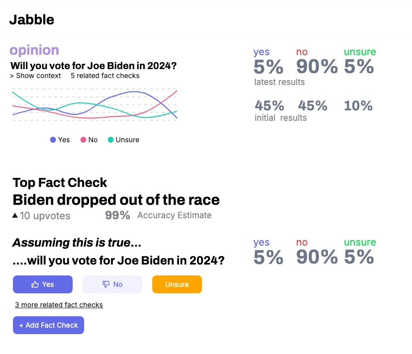

# Proposed New Factcheck-Based Algorithm

So what if, under a fact checks or opinion poll, all replies are other fact checks.

The system then chooses the top sub fact-check (initially, the one with the most upvotes). Users are then asked to respond to the poll assuming, or given, that the top sub-factcheck is true.

So for example, suppose an opinion poll asks *Will you vote for Joe Biden in 2024*? Initially 45% of users answer yes. 

But then the next day Biden drops out of the race, and somebody posts a sub-factcheck "Biden dropped out of the race". It gets a 99% accuracy estimate and is the top sub-factcheck.

The poll page now ask "Assuming it is true that Biden dropped out of the race...will you vote for Joe Biden in 2024." Now, only 5% of users answer yes. So that's the informed/final result.

Here's a screenshot illustrating what this might look like:

## Scoring formula:

- So now the informed/uninformed opinion is based on the conditional tally (e.g 5% voting for Joe Biden **given** he dropped out) and unconditional or initial tally (45% voting for Joe Biden initially), and the accuracy estimate of the top sub-factcheck.
- The effect of a sub-factcheck is the difference between the conditional and unconditional result. 
- The final/informed poll result is determined by adjusting the effect of the fact check by its accuracy estimate. In the above example, since the accuracy estimate is 99% then there is no adjustment (the final result is 5%). But say initially it was just a rumor that Biden dropped out, with accuracy estimate of 50%. Then the effect would be multiplied by 50%, and the score would be midway between 45% and 5%.

## Threads

So any single fact check, even if true, may be misleading, so there needs to be the ability to respond to the top fact-check with the top counter-fact-check, etc.

## Reasoning

Some of the problems I am trying to solve with this modified approach.

1. One, ambiguity in whether somebody "considered" something or not. Now, we explicitly ask users to consider things.
1. No counter-intuitive situations where downvoting something causes it to have more of an effect.
1. Distributed reasoning. Sub-fact-checks can be debated independently, and the results of factchecks deeper in the conversation tree "bubble up" automatically. For example, if it turns out it was just a rumor that biden dropped out, and the accuracy estimate for "Biden dropped out of the race" is 0%, then we don't need people to change their votes on the top-level poll -- we can automatically adjust the result.

